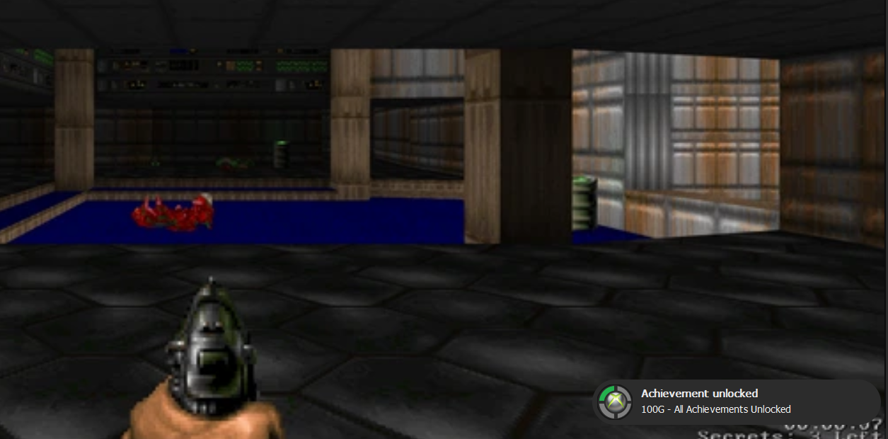
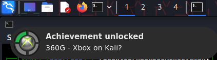

# Xbox 360 Achievement notification🎮

A lightweight recreation of the legendary **Xbox 360 achievement notification system**, built with Python + PyQt5.


---

## Preview✨ 



---
## 📦 Installation

### 1. Clone the repo

```bash
git clone https://github.com/MAXIVA11/Xbox360Achievement.git
cd Xbox360Achievement
```

### 2. Install dependencies

```bash
pip install -r requirements.txt
```

---

## Usage▶️ 

### Basic run

```bash
python Xbox360AchievementPopUp.py
```

---

## CLI Arguments⚙️ 

Customize your achievement popup:

```bash
python Xbox360AchievementPopUp.py
  --title "First Blood"
  --gamerscore 10
  --icon Icon/XboxIcon.png
  --sound Sound/achievement.wav
  --side bottom-right
```

### Arguments

| Argument | Default | Description |
|----------|--------|-------------|
| `--title` | All Achievements Unlocked | Achievement title text |
| `--gamerscore` | 100 | Gamerscore value |
| `--icon` | Icon/XboxIcon.png | Achievement icon |
| `--sound` | Sound/achievement.wav | Sound effect |
| `--side` | bottom-right | Screen side |

---

## Disclaimer⚠️ 

This project is a fan-made recreation of Xbox 360 UI elements for educational and nostalgic purposes only.  
It is not affiliated with Microsoft or Xbox.

---


## Bonus🎉
Also works on Linux!


